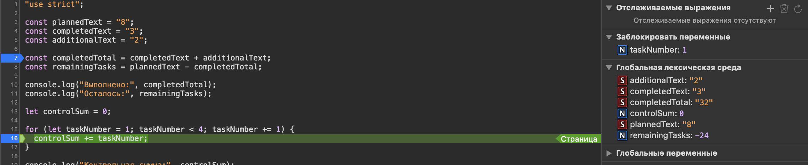

# Практическая работа № 1

## Автор и вариант

Имя: Бачинский Даниэль Денисович
Группа: ЭФБО-06-25
Вариант: 4

## Окружение

- ОС: macOS Tahoe 26.6.2
- Node.js: NodeJs v24.21.0
- npm: Npm v11.19.0
- Git: Git 2.50.1 (Apple Git-155)
- Браузер: Safari, Версия 26.6.2 (21624.5.1.11.3)

## Запуск

Команды из корня репозитория `tip-js-practices`: 
```
node practice-01/js/hello.js
node practice-01/js/types.js
node practice-01/js/progress.js
node practice-01/js/plan.js
node practice-01/js/debug.js
```
Для браузера: открыть `practice-01/index.html`, при необходимости заменить путь в `<script src="./js/...">` на нужный файл, сохранить, перезагрузить страницу и посмотреть вкладку Console в DevTools.

## Задание 1

Запустил файл `hello.js` двумя способами:

**В Node.js** вывод:
```
Студент: Бачинский Даниэль Денисович
Группа: ЭФБО-06-25
Практическая работа: 1
JavaScript успешно запущен
Тип document: undefined
```

**В браузере (Console)** вывод:
```
[Log] Студент: Бачинский Даниэль Денисович (hello.js, line 7)
[Log] Группа: ЭФБО-06-25 (hello.js, line 8)
[Log] Практическая работа: 1 (hello.js, line 9)
[Log] JavaScript успешно запущен (hello.js, line 10)
[Log] Тип document: – "object" (hello.js, line 11)
```


**Вывод:** результат отличается только в последней строке — `typeof document`. В Node.js получаем `undefined`, потому что там нет браузерной страницы и объекта `document`. В браузере получаем `object`, потому что браузер создаёт объект `document`, представляющий открытую HTML-страницу. Оба вывода получаем в консолях.

## Задание 2 

| Выражение | Ожидание до запуска | Фактическое значение | Тип результата | Объяснение |
|---|---|---|---|---|
| `"8" + 2` | 82 | 82 | string | '+' склеивает строки |
| `"8" - 2` | ошибка | 6 | string | '-' не умеет работать с текстом, поэтому JS переводит "8" в цифру |
| `Number("8") + 2` | 10 | 10 | number | 8 преобразовано в цифру, обычное сложение |
| `"12" > "3"` | false | false | boolean | Сравнение идет посимвольно, "1" < "3" |
| `12 === "12"` | false | false | boolean | Строгое сравнение не приводит типы |
| `Number("")` | 0 | 0 | number | Пустая строка и строка из пробелов преобразуется в 0, такая особенность Number() |
| `Number("text")` | ошибка | NaN | number | "text" непреобразуемый в число текст, поэтому Nan - Not a number |
| `Boolean("false")` | true | true | boolean | Boolean на любую не пустую строку выдает true |
| `typeof null` | null | object | string | Исторический баг |
| `typeof NaN` | undefined | number | string | NaN - специальное числовое значение, а не отдельный тип данных |

## Задания 3 и 4

### Задание 3 (progress.js)

| Проверка | totalTasks | completedTasks | Ожидание | Фактический результат | Итог |
|---|---|---|---|---|---|
| Обычный случай | 12 | 5 | Осталось 7, 41.7%, В работе | Осталось: 7, Прогресс: 41.7%, Статус: В работе | Пройдено |
| Оба нуля | 0 | 0 | Задач пока нет | Задач пока нет | Пройдено |
| Не начато | 5 | 0 | Осталось 5, 0.0%, Не начато | Осталось: 5, Прогресс: 0.0%, Статус: Не начато | Пройдено |
| Завершено | 5 | 5 | Осталось 0, 100.0%, Завершено | Осталось: 0, Прогресс: 100.0%, Статус: Завершено | Пройдено |
| Превышение | 5 | 6 | Ошибка | Ошибка: выполнено больше, чем существует | Пройдено |
| Отрицательное | -1 | 0 | Ошибка | Ошибка: диапазон 0...1000 | Пройдено |
| Дробное | 5 | 2.5 | Ошибка | Ошибка: должны быть целыми числами | Пройдено |
| Строка | "5" | 2 | Ошибка | Ошибка: должны быть целыми числами | Пройдено |
| Превышена граница | 1001 | 0 | Ошибка | Ошибка: диапазон 0...1000 | Пройдено |
| NaN | NaN | 0 | Ошибка | Ошибка: должны быть целыми числами | Пройдено |
| Свой вариант | 20 | 11 | — | Осталось: 9, Прогресс: 55.0%, Статус: В работе | Пройдено |

### Задание 4 (plan.js)

| Проверка | totalTasks | completedTasks | dailyLimit | Ожидание | Фактический результат | Итог |
|---|---|---|---|---|---|---|
| Обычный случай | 12 | 5 | 3 | 3 дня | Потребуется дней: 3 (последний день — 1 задача) | Пройдено |
| Ровно делится | 10 | 4 | 3 | 2 дня | Потребуется дней: 2 (по 3 задачи в день) | Пройдено |
| Лимит больше остатка | 5 | 3 | 10 | 1 день | Потребуется дней: 1 (выполнено 2 задачи) | Пройдено |
| Уже завершено | 5 | 5 | 2 | 0 дней | Все задачи уже выполнены, Потребуется дней: 0 | Пройдено |
| Оба нуля | 0 | 0 | 2 | 0 дней | Все задачи уже выполнены, Потребуется дней: 0 | Пройдено |
| Нулевой лимит | 5 | 2 | 0 | Ошибка | Ошибка: диапазон 1...1000 | Пройдено |
| Дробный лимит | 5 | 2 | 1.5 | Ошибка | Ошибка: должен быть целым числом | Пройдено |
| Некорректно выполнено | 5 | 6 | 2 | Ошибка | Ошибка: выполнено больше, чем существует | Пройдено |
| Лимит-строка | 5 | 2 | "2" | Ошибка | Ошибка: должен быть целым числом | Пройдено |
| Лимит вне диапазона | 5 | 2 | 1001 | Ошибка | Ошибка: диапазон 1...1000 | Пройдено |
| Свой вариант | 20 | 11 | 6 | — | Потребуется дней: 2 | Пройдено |

## Задание 5

Исходный вывод (до исправлений):
```
Выполнено: 32
Осталось: -24
Контрольная сумма: 6
```

Вывод после исправления:

```
Выполнено: 5
Осталось: 3
Контрольная сумма: 10
```



| Ошибка | Что наблюдалось | Причина | Исправление | Результат после исправления |
|---|---|---|---|---|
| Обработка количества задач | `completedTotal` = "32" вместо 5 | Строки складывались через `+`, что даёт склеивание текста, а не арифметику | Обернул оба слагаемых в `Number(...)` | `completedTotal` = 5, `remainingTasks` = 3 |
| Граница цикла | Сумма получалась 6 вместо 10 | Условие `taskNumber < 4` не включает само число 4 | Заменил `<` на `<=` | Контрольная сумма = 10 |

## Дополнительное задание. Вариант А (progress-input.js)

Реализована обработка входных данных, приходящих строками: проверка типа, удаление пробелов через `trim()`, отклонение пустого ввода, преобразование через `Number()` и повторное применение ограничений Задания 3.

**Почему недостаточно просто `Number()` и проверки на неотрицательность:** пустая строка, строка из пробелов и `null` через `Number()` превращаются в `0`, который формально проходит проверку `>= 0`, хотя по смыслу не является валидным вводом. `Number("Infinity")` даёт `Infinity` — тоже "неотрицательное" число, но не подходящее по смыслу количество задач. Дробные строки вроде `"2.5"` превращаются в дробное число, хотя нужны только целые. Поэтому реализована многоступенчатая проверка: тип → непустота после `trim()` → конечность (`Number.isFinite`) → целочисленность (`Number.isInteger`) → диапазон.

**Проверки:**

| Входные данные | Ожидание | Результат |
|---|---|---|
| `"12"`, `"5"` | Обычная сводка | совпало |
| `"  12  "`, `"  5  "` | Обычная сводка | совпало |
| `""`, `"5"` | Ошибка (пустой ввод) | совпало |
| `"abc"`, `"5"` | Ошибка (не число) | совпало |
| `"2.5"`, `"5"` | Ошибка (не целое) | совпало |
| `"Infinity"`, `"5"` | Ошибка (не конечное) | совпало |
| `null`, `"5"` | Ошибка (не строка) | совпало |

## Вывод

За время выполнения работы освоил базовый цикл разработки на JavaScript: написание кода, запуск в двух средах (Node.js и браузер), предсказание и проверку поведения при неявном приведении типов, написание условий с многоступенчатой валидацией входных данных, цикл `while` с гарантированным завершением, поиск ошибок через точки останова в DevTools.

Наиболее показательной ошибкой оказалось неявное приведение типов при сложении/вычитании строк (Задание 5) — код не выдаёт исключения, но даёт логически неверный результат, который без отладчика было бы сложно быстро найти.

Дополнительно выполнен Вариант А — обработка строковых входных данных с защитой от некорректного ввода (пустая строка, нечисловой текст, бесконечность, `null`/`undefined`).
