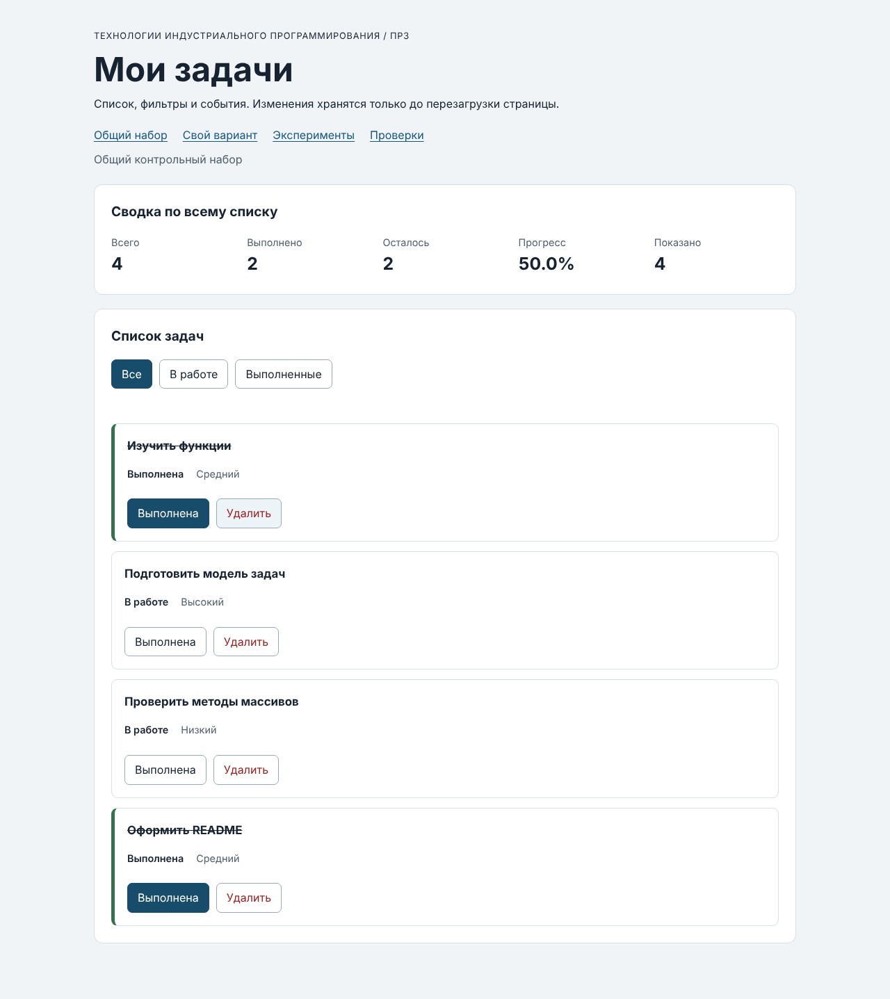

# Практическая работа № 3. Работа с DOM и событиями

## Данные работы

| Поле | Значение |
|---|---|
| Имя | Бачинский Даниэль Денисович |
| Группа | ЭФБО-06-25 |
| Вариант из ПР2 | 4 (подготовка семинара) |
| Node.js | v24.21.0 |
| Браузер | Safari 26.6.2 (21624.5.1.11.3) |
| Операционная система | macOS Tahoe 26.6.2 |

## Запуск

Рабочая папка: `practice-03` внутри личного репозитория.

```bash
npm run check:service
npm start
```

Устанавливать зависимости через `npm install` не требуется. Без npm: `node checks/service.checks.js` и `node tools/serve.mjs`.

```text
http://127.0.0.1:5503/
http://127.0.0.1:5503/index.html?dataset=variant
http://127.0.0.1:5503/examples/dom-events.html
http://127.0.0.1:5503/checks.html
```

Остановка сервера: `Ctrl+C`.

## Что перенесено из ПР2

`src/task-service.js` и `src/data.js` скопированы из `practice-02/src` без изменений. Повторная проверка `npm run check:service` — 35 из 35 сценариев пройдены. Исправлений в функциях ПР2 не потребовалось.

## Эксперименты

| № | До запуска: прогноз | После запуска: результат | Объяснение |
|---:|---|---|---|
| 1. Отсутствующий элемент и коллекция | `null` и длина `0` | `Отсутствующий элемент: null`, `Пустая коллекция: 0` | `querySelector` без совпадений возвращает `null`, обращение к его свойствам вызвало бы ошибку. `querySelectorAll` возвращает пустой `NodeList`, у которого есть `length`. |
| 2. dataset и числовой id | `"23"` типа string, после `Number` — `23` | `dataset.taskId: 23 string`, `Числовой id: 23` (number) | Значения `data-*` всегда хранятся строками. Для функций ПР2 нужен число, поэтому идентификатор явно преобразуется через `Number`. |
| 3. Статический NodeList | Старый `NodeList` останется длиной 1, новый запрос — 2, затем 3 | Старый: `1`, `1`; новый `querySelectorAll`: `2`, `3` | `querySelectorAll` возвращает статический снимок на момент вызова. Новые элементы в него не попадают, нужен повторный запрос. |
| 4. Строка с HTML-разметкой | Заголовок покажет текст с угловыми скобками, тегов внутри не будет | Отображается `<strong>Это текст, а не HTML</strong>`, дочерних элементов у заголовка `0` | `textContent` записывает строку как текст и не разбирает её как HTML, поэтому элемент `strong` не создаётся. |
| 5. Распространение события | Сначала захват на карточке, затем кнопка, затем всплытие на карточке | `1. phase=1; target=lab-label; currentTarget=lab-card` → `2. phase=3; target=lab-label; currentTarget=lab-button` → `3. phase=3; target=lab-label; currentTarget=lab-card` | `target` всё время — `span` (место нажатия), а `currentTarget` — элемент, чей обработчик выполняется. Кнопка получает событие в фазе всплытия (3), так как цель — вложенный `span`. Поэтому обработчик на контейнере получает клики по любым вложенным элементам — на этом построено делегирование. |

## Организация кода

| Файл | Ответственность |
|---|---|
| `task-service.js` | Функции ПР2: поиск, сводка, изменение статуса, удаление. Без `document`. |
| `task-selectors.js` | `getVisibleTasks` — новый массив по фильтру `all` / `pending` / `completed` (через `filter` и spread). |
| `task-view.js` | Создание карточки DOM-методами (`createElement`, `textContent`), замена списка через `replaceChildren`, сводка и пустое состояние. Обработчиков и изменения данных нет. |
| `main.js` | Состояние, обработчики событий и `renderApp`. |

Полный список хранится в `currentTasks`, фильтр — в `currentFilter` (обе переменные в `main.js`). Видимая выборка не сохраняется, а вычисляется в `renderApp` заново. События кнопок карточек обрабатываются делегированно одним обработчиком `handleTaskListClick` на `ul#task-list`, фильтры — `handleFilterClick` на `#task-filters`. Подписки выполняются один раз. Сводка вычисляется `getTaskStats(currentTasks)` внутри `renderSummary` по полному массиву, а «Показано» — длина видимой выборки.

## Общий сценарий

| Шаг | Видимые id | Всего | Выполнено | Осталось | Прогресс | Показано | Сообщение | Совпало с ожиданием |
|---:|---|---|---|---|---|---|---|---|
| 0 | `[1, 4, 7, 10]` | 4 | 2 | 2 | 50.0% | 4 | — | Да |
| 1 | `[4, 7]` | 4 | 2 | 2 | 50.0% | 2 | — | Да |
| 2 | `[7]` | 4 | 3 | 1 | 75.0% | 1 | — | Да |
| 3 | `[1, 4, 7, 10]` | 4 | 3 | 1 | 75.0% | 4 | — | Да |
| 4 | `[1, 4, 10]` | 3 | 3 | 0 | 100.0% | 3 | — | Да |
| 5 | `[]` | 3 | 3 | 0 | 100.0% | 0 | Нет задач по выбранному фильтру. | Да |
| 6 | `[1, 4, 10]` | 3 | 2 | 1 | 66.7% | 3 | — | Да |
| 7 | `[]` | 0 | 0 | 0 | 0.0% | 0 | Список задач пуст. | Да |

После перезагрузки: вернулось исходное состояние шага 0 (`[1, 4, 7, 10]`, 4 / 2 / 2 / 50.0%). Это ожидаемо: в ПР3 данные хранятся только в памяти страницы.

## Индивидуальный вариант

Тема — подготовка семинара. Исходные задачи (`src/data.js`): 11 «Выбрать тему семинара», 23 «Забронировать аудиторию», 37 «Разослать приглашения участникам» — выполнены; 41 «Подготовить презентацию», 58 «Составить раздаточные материалы», 64 «Собрать обратную связь» — в работе. Приоритеты `low`, `medium`, `high` присутствуют.

| Этап | Всего | Выполнено | Осталось | Прогресс | Видимые id |
|---|---|---|---|---|---|
| До действий | 6 | 3 | 3 | 50.0% | `[11, 23, 37, 41, 58, 64]` (фильтр «В работе»: `[41, 58, 64]`, «Выполненные»: `[11, 23, 37]`) |
| После переключения 23 | 6 | 2 | 4 | 33.3% | `[11, 23, 37, 41, 58, 64]` |
| После удаления 37 | 5 | 1 | 4 | 20.0% | `[11, 23, 41, 58, 64]` |
| Итог, фильтр «В работе» | 5 | 1 | 4 | 20.0% | `[23, 41, 58, 64]` |
| Итог, фильтр «Выполненные» | 5 | 1 | 4 | 20.0% | `[11]` |

Итоговый прогресс 20.0% совпадает с контрольным значением для варианта 4; оставшиеся идентификаторы `[11, 23, 41, 58, 64]`.

## Протокол проверки сервиса

```text
OK: 01. Создание задачи с явным приоритетом
OK: 02. Приоритет по умолчанию
OK: 03. Удаление краевых пробелов без изменения внутренних
OK: 04. Граничные длины названия и положительный безопасный id
OK: 05. Некорректные названия при создании
OK: 06. Некорректные идентификаторы при создании
OK: 07. Все допустимые приоритеты и отклонение недопустимых
OK: 08. Каждый вызов createTask возвращает новый объект
OK: 09. Поиск по id, а не по индексу
OK: 10. Отсутствующая задача и пустой массив при поиске
OK: 11. Поиск не преобразует строковый id в число
OK: 12. Получение невыполненных задач
OK: 13. Пустой список, все выполнены и все не выполнены
OK: 14. Названия в исходном порядке и пустой список
OK: 15. Сводка по общему набору
OK: 16. Сводка по пустому списку
OK: 17. Сводка: ничего не выполнено и выполнено всё
OK: 18. Процент остаётся числом без предварительного округления
OK: 19. Добавление в конец без изменения входного массива
OK: 20. Добавление в пустой список с приоритетом по умолчанию
OK: 21. Повторяющийся id отклоняется
OK: 22. Добавление не обходит проверки createTask
OK: 23. Изменение completed в обе стороны
OK: 24. completed принимает только boolean
OK: 25. Некорректный или отсутствующий id при изменении статуса
OK: 26. Повторная установка статуса создаёт новый результат
OK: 27. Переименование сохраняет остальные поля
OK: 28. Проверки названия при переименовании
OK: 29. Некорректный или отсутствующий id при переименовании
OK: 30. Удаление по id с сохранением порядка
OK: 31. Удаление единственной записи
OK: 32. Некорректный, отсутствующий id и удаление из пустого списка
OK: 33. Входные объекты не изменяются ни одной операцией
OK: 34. Общий сценарий и все промежуточные сводки
OK: 35. Работа с другим набором, без зависимости от demoTasks

Проверок пройдено: 35; не пройдено: 0.
```

## Протокол браузерных проверок

```text
OK: Фильтр all возвращает новый массив в исходном порядке
OK: Фильтр pending выбирает невыполненные задачи
OK: Фильтр completed выбирает выполненные задачи
OK: Все три фильтра работают с пустым списком
OK: Фильтрация не меняет входные записи и их порядок
OK: Карточка — li.task-card с числовым id в dataset
OK: Статус невыполненной карточки и aria-pressed согласованы
OK: Статус выполненной карточки и aria-pressed согласованы
OK: В карточке две обычные кнопки с вложенными подписями
OK: Все приоритеты отображаются по установленному словарю
OK: Название с разметкой отображается текстом
OK: Отрисовка списка создаёт карточки в исходном порядке
OK: Повторная отрисовка не накапливает карточки
OK: Контейнер списка и его обработчик сохраняются
OK: Отрисовка пустого массива очищает прежние карточки
OK: Сводка считается по всему списку, отдельно выводится Показано
OK: Пустая сводка не содержит NaN и Infinity
OK: Сообщение для полностью пустого списка
OK: Сообщение для пустого результата фильтра
OK: Появление карточек скрывает прежнее пустое состояние
OK: Приложение: начальный набор и сводка
OK: Приложение: фильтр срабатывает по клику на вложенный span
OK: Приложение: активный фильтр отмечен классом и aria-pressed
OK: Приложение: фильтрация не удаляет скрытые задачи
OK: Приложение: переключение по id, а не индексу массива
OK: Приложение: выполненная задача исчезает из фильтра В работе
OK: Приложение: удаление изменяет данные, а не только DOM
OK: Приложение: клик по названию не изменяет данные
OK: Приложение: после перерисовок одно нажатие — одно изменение
OK: Приложение: удаление всех записей и нулевая сводка
OK: Приложение: нет совпадений — не то же самое, что нет задач
OK: Приложение: неизвестный числовой id не меняет данные
OK: Приложение: id 4abc не превращается в 4
OK: Приложение: неизвестное действие игнорируется
OK: Приложение: после изменения сохраняется клавиатурный фокус
OK: Приложение: новая загрузка возвращает исходное состояние

Всего: 36. Пройдено: 36. Ошибок: 0.
```

## Собственные проверки

| № | Исходное состояние и действия | Ожидаемый результат | Фактический результат | Итог |
|---:|---|---|---|---|
| 1 (граничное) | Общий набор; удалить 1, 7, 10 — осталась одна задача `id = 4`; затем трижды подряд нажать «Выполнена» у неё | После удалений 1 / 0 / 1 / 0.0%; после трёх переключений задача выполнена: 1 / 1 / 0 / 100.0% | Единственная задача `[4]`, 1 / 0 / 1 / 0.0%; после трёх нажатий 1 / 1 / 0 / 100.0% | Пройдено |
| 2 (событие и перерисовка) | Общий набор; фильтр «Выполненные»; снять отметку у `id = 1`; затем фильтр «В работе» | Задача 1 исчезает из «Выполненных» (видно `[10]`), сводка 4 / 1 / 3 / 25.0%, показано 1; в «В работе» видно `[1, 4, 7]`, показано 3 | Видно `[10]`, 4 / 1 / 3 / 25.0%, показано 1; затем `[1, 4, 7]`, показано 3 | Пройдено |
| 3 (клавиатура) | Общий набор; Tab до кнопки «Выполнена» у `id = 4`, нажать Enter, затем Space | Enter отмечает задачу (4 / 3 / 1 / 75.0%), фокус остаётся на кнопке «Выполнена» той же задачи; Space возвращает 4 / 2 / 2 / 50.0% | После Enter 4 / 3 / 1 / 75.0%, фокус на `toggle` карточки `id = 4`; после Space 4 / 2 / 2 / 50.0% | Пройдено |

## Отладка и клавиатура

Точка останова — строка `const rawId = card.dataset.taskId;` в `handleTaskListClick` (`src/main.js`). Нажатие на подпись «Выполнена» у задачи `id = 4`:

- `event.target` — `span.action-label` (место нажатия);
- `event.currentTarget` — `ul#task-list` (элемент с делегированным обработчиком);
- `button` после `closest` — `button[data-action="toggle"]`, `action = "toggle"`;
- `card.dataset.taskId` — `"4"` (string), после `Number` — `4` (number);
- найденная запись — `{ id: 4, title: "Подготовить модель задач", completed: false, priority: "high" }`;
- результат `setTaskCompleted(currentTasks, 4, true)` — `{ ok: true, tasks: [...] }`, в новом массиве у `id = 4` `completed: true`, остальные объекты те же.

Путь события: клик по `span` → всплытие до `ul` → `closest` находит кнопку → id из карточки → функция ПР2 → `currentTasks = result.tasks` → `renderApp()` → `restoreTaskFocus`.

Клавиатура: Tab переходит по ссылкам, фильтрам и кнопкам карточек; Enter и Space нажимают кнопки (это настоящие `button`). После изменения статуса фокус возвращается на ту же кнопку той же задачи; после удаления или исчезновения карточки из фильтра — на активную кнопку фильтра.

Отказы: через Elements у карточки `id = 4` значение `data-task-id` заменено на `777` — после «Удалить» выведено «Ошибка: Задача с id = 777 не найдена», сводка осталась 4 / 2 / 2 / 50.0%. Значение `4abc` — «Ошибка: некорректный идентификатор задачи «4abc»», данные не изменились. После нажатия фильтра «Все» карточки пересоздаются из настоящего массива с правильными id, сообщение очищается.

## Вид приложения



## Дополнительное задание

Дополнительное задание не выполнялось.

## Вывод

Функции ПР2 подключены к браузерному интерфейсу без переписывания: карточки строятся DOM-методами, названия выводятся через `textContent`, действия обрабатываются делегированно одним обработчиком на списке, фильтр меняет только отображение. Все 35 проверок сервиса и 36 браузерных проверок пройдены, общий сценарий и вариант 4 совпали с ожиданиями.

Главное различие между изменением данных и изменением DOM: удаление `<li>` из страницы не удаляет задачу — после следующей отрисовки она появилась бы снова. Источник истины — массив `currentTasks`, который меняется только через функции ПР2, а DOM каждый раз перестраивается из него.
